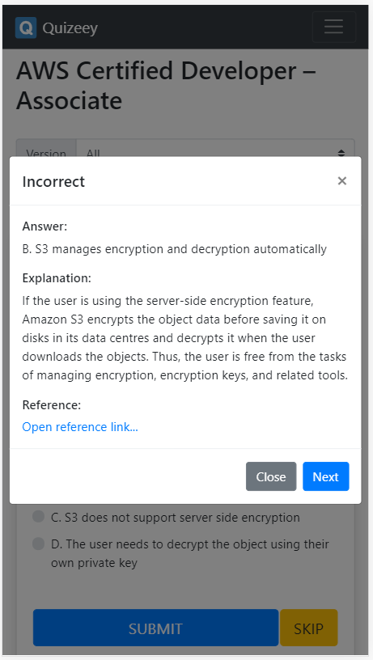

# Quizeey

(한글) http://quizeey.com/
(English) http://quizeey.com/en

The idea of Quizeey, pool of quizzes, first came out when I was studying for the AWS Certified Developer - Associate exam. 
Most of the time I used my smart phone to study the AWS practice questions which was a PDF file. 
It was so hard to see the PDF file through a small phone screen and with an answer placed right under the questions make it hard to concentrate.
So I decided to make a mobile friendly pool of quizzes to study more effectively.

---

